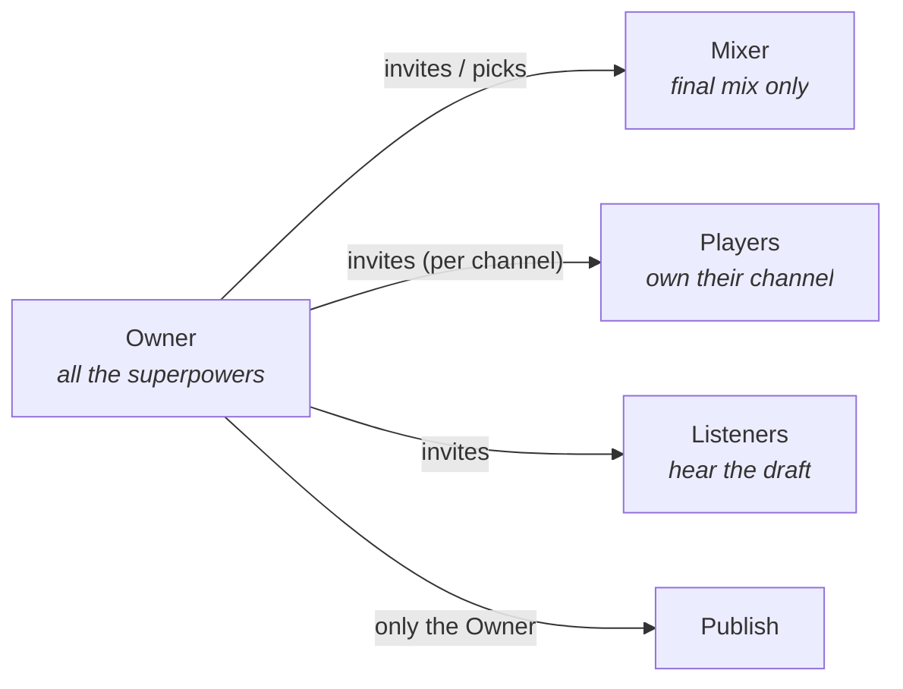
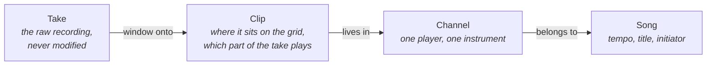
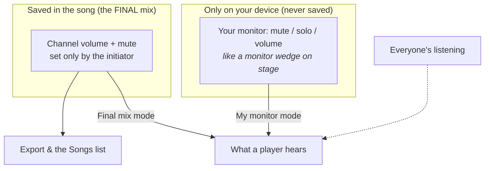
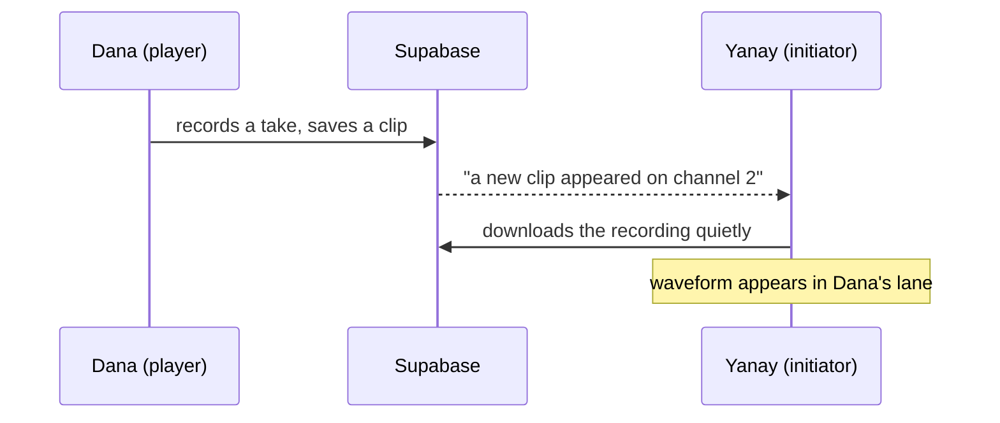
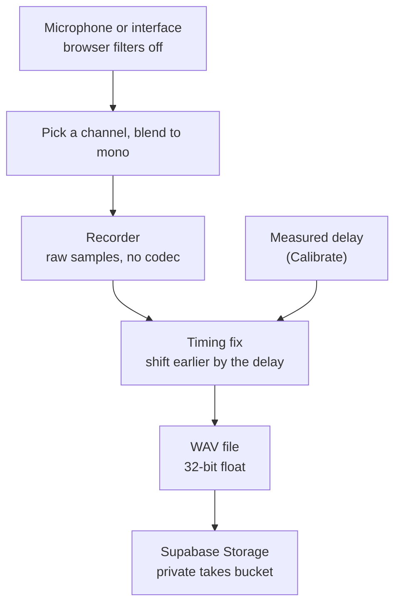

# Play Your Line

A collaborative music app. One person (the **initiator**) starts a song and adds
channels — Guitar, Bass, Vocals. Each channel is given to a specific musician
through a one-time invite link. Every player records **only their own
channel**, and when all the parts are in, the initiator **publishes** the song to
a shared list that any signed-in user can listen to.

The workspace is modeled on Pro Tools / Logic so it feels familiar: stacked
channels with waveforms, a shared transport and playhead, tempo and click,
mute / solo / volume, and non-destructive trimming.

> Why not live jamming? Real-time playing across continents is blocked by
> network delay (100–300 ms round trip; musicians tolerate ~20–30 ms). So the
> product is built around **relay collaboration**: each player records against
> the existing mix on their own time. Tight sync between the click and every
> recorded part is what makes the result sound like the artists meant it to.

## How a song works

There are four roles. **One person owns the song; each channel belongs to one player.**

| | Owner | Mixer | Player | Listener |
| --- | :---: | :---: | :---: | :---: |
| Who | The person who created the song (the "initiator") | One optional person the Owner picks | Whoever is assigned to a channel | Invited to hear the draft |
| Rename song, invite people | ✅ | – | – | – |
| **Add a new (empty) channel** | ✅ | ✅ | ✅ | ✅ |
| Invite a player to a channel | ✅ | – | – | – |
| Choose the Mixer, remove a Listener | ✅ | – | – | – |
| Set the tempo (until something is recorded) | ✅ | – | – | – |
| Default channel order and colours (saved for all) | ✅ | – | – | – |
| Remove a channel (only while it is empty) | ✅ | – | – | – |
| **Set the final mix** (volume, mute per channel) | ✅ | ✅ | – | – |
| **Channel FX** (EQ / Compressor / Delay / Reverb) | ✅ any channel | ✅ any channel | ✅ their own channel | – |
| Record and edit **clips** | only their **own** channel | only their own channel | ✅ their channel | – |
| Personal monitor mix, own order and colours (this device) | – | – | ✅ | ✅ |
| **Publish** / **Unpublish** the song (Unpublish takes it back to a draft and off the Songs list) | ✅ | – | – | – |
| Hear the draft | ✅ | ✅ | ✅ | ✅ |

Anyone signed in can listen to **published** songs at `/songs`.

A person can hold several roles: the Owner is also a Mixer, and the Mixer can also
be a Player. A small badge next to the tempo shows *your* role. The key idea is
unchanged: **nobody touches a player's recordings but that player.**



How people join: **Players** get a link per channel, from *Add channel* — this is
for a regular player who will record. **Mixer** and **Listener** — for balancing levels
or just listening to the draft — get a separate link from the *People* section (the Owner can also pick an existing player as Mixer).
Links are one-time and work only once someone signs in. A person's display name
(shown everywhere, including in People) comes straight from their Google account —
Google sometimes assigns a random name like "Thinks Toomany" to an account that never
set one; that isn't a bug, it's just what that account is called.

These rules are enforced by the database (row-level security and triggers), not
just hidden in the UI, so they hold even if someone calls the API directly.

### Channels, takes and clips



Every edit only changes a clip's numbers, so **nothing is ever destroyed**:
trim a clip and the audio you cut is still in the take; drag the edge back and
it returns. A clip is just: *start on the timeline · start inside the take ·
length · stacking order*.

### The channel lane

```
┌──────────────┬──────────────────────────────────────────────────────┐
│ Bar          │ 1       2       3       4       5       6            │  ← shared ruler
├──────────────┼──────────────────────────────────────────────────────┤
│ ● Dana       │        ┌────────────┐          ┌─────┐               │
│   Guitar     │        │ ∿∿∿∿∿∿∿∿∿∿ │          │∿∿∿∿∿│               │  ← clips on the grid
│ [●] [M][S] ─○│        └────────────┘          └─────┘               │
├──────────────┼──────────────────────────────────────────────────────┤
│   Unclaimed  │  Waiting for a player to join this channel           │
│   Bass       │                                                      │
└──────────────┴──────────────────────────────────────────────────────┘
   Info column                       4/4 bar grid  (playhead runs across all lanes)
   (stays put when
    you scroll)
```

### Adding audio: record, or drop a file

Besides recording, you can drag an audio file straight onto your own channel from your
computer. It's decoded, re-encoded as the same 32-bit float WAV every recording uses, uploaded,
and lands as a clip exactly where you dropped it (snapped to the grid, hold Alt to place freely).
This works only on a channel you own, and never while a recording is in progress. Because it's
re-encoded to full-quality WAV, a very long file can exceed Supabase's per-file storage limit —
the app checks this before uploading and tells you roughly how many minutes fit, rather than
letting the upload fail with a raw storage error.

### Rules of the timeline

| Rule | What it means |
| --- | --- |
| **Time signature** | 4/4 only for now (one constant, `BEATS_PER_BAR`, in `src/lib/grid.ts`) |
| **Snap** | Toggle in the toolbar (magnet). Choose Bar, 1/4, 1/8 or 1/16 — default **on, 1/16**. Hold **Alt** while dragging to place freely. |
| **Tempo lock** | The tempo locks the moment the song has any clip (moving it would drag every recording off the beat). Delete all clips to unlock. |
| **Overlap** | Where two clips overlap, the **newest plays** and the older one is silent underneath — but keeps playing wherever it isn't covered. |
| **Recording placement** | A new take lands exactly where the click was when you pressed record (count-in and latency compensated). |

```
Overlap example — newest clip on top:

older clip   ████████████████████
newer clip            ██████████
what you hear ███████████████████   older plays until the newer one starts,
                     └─ newer ─┘    then the newer takes over
```

### Two mixes: your monitor vs the final mix



- A **player** chooses in the toolbar: **My monitor** (their own levels, saved
  only in their browser) or **Final mix** (exactly what the initiator saved,
  read-only).
- The **initiator's** sliders *are* the final mix and are saved for everyone.
- **Solo** is a listening aid on your own device. It is never saved and never
  ends up in an export.
- Later: EQ, reverb and delay will live on the initiator's final mix.

### Live updates (no refresh needed)

When someone else changes the song, you see it appear on its own. A small
**Live** dot next to the song title shows the connection is on.



| What happens | What you see |
| --- | --- |
| A channel is added, removed, or a player joins it | The lane appears / disappears / gets the player's name |
| A player records, moves, trims or deletes a clip | The clip appears, moves or vanishes in their lane |
| The initiator changes tempo, title, or publishes | Header updates; published state changes |
| The initiator moves a fader | Players in **Final mix** mode hear the new level |
| Connection drops, or a phone wakes up | The app catches up by itself (dot shows Offline → Live) |

Good to know:
- Changes never restart playback. If someone edits while you're listening, you
  hear it from the **next Play**.
- Your own channel is never overwritten by live updates (you're its only editor).
- **Who's here:** small circles next to the song title show who has the song
  open right now; a green dot appears by a player's name on their channel while
  they are here.
- Not included yet: a live "Dana is recording…" badge.

### Colours, zoom and storage

- **Channel colour:** tap the coloured number tab on a channel and pick a colour.
  The initiator's choice is saved for everyone; anyone else recolours only for
  themselves (on their own device).
- **Pinch to zoom:** on a Mac trackpad, pinch over the timeline (or hold Ctrl and
  scroll). The moment under your fingers stays in place. The +/- buttons still work.
- **Storage cleanup:** when you open a song, recording files on *your* channels
  that no clip uses any more (from deleted clips or failed uploads) are deleted.
  Files younger than 10 minutes are never touched, and removing an empty channel
  clears its leftover files. Nobody's recordings are removed by anyone else.
- **How much space you use:** Supabase → Project Settings → Usage, or run in the
  SQL Editor: `select round(sum((metadata->>'size')::bigint)/1048576.0) as mb, count(*) as files from storage.objects where bucket_id = 'takes';`
  Recordings are 32-bit float WAV, about **11.5 MB per minute per channel**.

### The screen: control bar, loop and phones

```
┌────────────────────────────────────────────────────────────────────────────┐
│ [⚙][👤+][⊕]  [⏮][▶][■][●]   ┌ 2 │ 3 │ 0:03.9 │ − 90 + │ 4/4 ┐    [⟲][1234][♩][S] │
│  settings / people / add     │  bar beat  time    bpm   sig  │     loop count-in click clear-solo │
│                              └──── number display, centred ──┘                    │
├────────────────────────────────────────────────────────────────────────────┤
│ [↶][↷] [✂][⧉][🗑] [🧲 1/16] [− +]                        editing tools          │
└────────────────────────────────────────────────────────────────────────────┘
```

- **Control bar** (Logic style): panel buttons on the left — audio settings and **Add channel**
  (anyone in the song), **People** (Mixer/Listener invites, Owner only) — then transport (back to
  start, play, **stop**, **record**), the dark number display in the middle (bar, beat, time,
  tempo, signature), and on the right loop, **1234** count-in (blue when on), click on/off with
  its volume, and **S** which turns off every solo. Editing tools sit on a slim second row.
- **Record** is the red button in the bar (or the **R** key). It records on your **armed**
  channel: on each of your channels a small dot button (next to M and S) arms it — filled red
  means Record goes there, locked while that channel is already recording. **Stop** (or **Space**)
  stops a recording if one's running, otherwise stops playback.
- **Your role** (Owner, Mixer, Player, Listener) is a small badge in the song header next to the title.
- **Loop:** drag on the thin strip *under the bar numbers* to highlight a part; it turns the loop
  on. Drag the highlight to move it, its edges to resize it (snaps to the grid, hold Alt to
  place freely). The **loop button** switches it on/off; with no highlight yet it uses the
  selected clip, or four bars from the playhead. The highlighted part is shaded across all
  channels. Playback runs from wherever you start to the loop's end, then repeats the loop.
  Every pass is scheduled on the same audio clock as the click, so nothing drifts. The loop is
  personal and temporary (never saved) and is ignored while recording and in exports.
- **Channels use the full screen width**, edge to edge, each as one strip: colour/number
  tab · instrument · player name · (on your own channel) an arm dot · M (mute) S (solo) · fader ·
  **FX** (Owner/Mixer, or the channel's own player). The fader is a real dB scale (−60..+6): 0 dB
  (unity, the default) rests near the top, like a real console — most of the travel is fine
  control right around unity, with a little headroom above and a steep drop toward silence below.
  Underneath the fader, a row of 5 signal lights shows the microphone level while that channel is
  armed, or the channel's own live output level the rest of the time.
- **Channel FX** (EQ / Compressor / Delay / Reverb): click **FX** to open a small, draggable
  plugin-style window — drag it by its title bar anywhere on screen. Pick one tool at a time from
  the tabs at the top. Every knob is drag-to-turn (vertical drag, hold Shift to fine-tune, scroll
  to nudge, double-click to reset). The EQ shows its real frequency-response curve, read straight
  off the actual filter — not a decoration, it's exactly what the channel sounds like. The
  Compressor has a live level meter. Volume and mute stay Owner/Mixer-only (the saved final mix);
  FX is different — a channel's own player can shape their own channel's sound too.
- **On a phone** (tested at 375 px wide, iPhone 13 mini): the bar sticks to the top while you
  scroll (the song header scrolls away). Row 1 is transport plus the number display; row 2
  is a sideways-sliding strip with everything else. Each channel strip is three short lines in
  a narrower column so the clips get the room. Drag-to-reorder is desktop only.
- **Errors** appear as a small dismissible message at the bottom of the screen.

### Keyboard shortcuts

| Key | Action |
| --- | --- |
| `Space` | Play / pause, or **stop an active recording** if one's running |
| `Enter` | Playhead back to the start |
| `R` | Record on your armed channel (press again to stop) |
| `S` | Split the selected clip at the playhead |
| `⌘/Ctrl + D` | Duplicate the selected clip (placed right after it) |
| `Delete` / `Backspace` | Delete the selected clip |
| `⌘/Ctrl + Z` / `⇧⌘/Ctrl + Z` | Undo / redo |
| `←` `→` | Nudge the selected clip by one snap step (with `Alt`: 1 ms) |
| `Esc` | Deselect |

## Quick start

**You need:** Node 22+, and a Supabase project (see *Set up Supabase* below).

```bash
git clone https://github.com/y-by/play-your-line.git
cd play-your-line
npm install
cp .env.example .env.local     # then fill in your two Supabase values
npm run dev
```

Open **https://localhost:5180** (type the `https://` — the dev server does not
answer plain `http://`). Your browser will warn about the self-signed
certificate; choose *Advanced → Proceed*. It is HTTPS on purpose: browsers only
allow microphone access on `localhost` or a secure address, and this is what
lets you record from a phone over the local network.

### Commands

| Command | What it does |
| --- | --- |
| `npm run dev` | Dev server on **https://localhost:5180** (self-signed HTTPS, reachable on your LAN) |
| `npm run dev:http` | Same, but plain HTTP — handy for automated browser testing |
| `npm run build` | Type-check and build to `dist/` |
| `npm run preview` | Serve the production build locally |
| `npm run lint` | Lint with oxlint |
| `npm run test:timing` | Check the latency-compensation math with synthetic recordings |

The port is pinned to 5180 because Supabase and Google sign-in are configured
for that exact address.

### Trying it on your phone

Same Wi-Fi as your computer, then open `https://<your-computer's-LAN-IP>:5180`
(Vite prints it as *Network* when the server starts). Accept the certificate
warning. Recording needs the `https://` address.

## Set up Supabase (one time)

1. Create a project at supabase.com.
2. **Authentication → Providers → Google:** enable it with a Client ID and
   Secret from a Google Cloud OAuth *Web application* client. Add Supabase's
   callback URL (`https://<project>.supabase.co/auth/v1/callback`) as an
   authorized redirect URI, and your app addresses as authorized JavaScript
   origins.
3. **Authentication → URL Configuration:** set *Site URL* to your app address
   and add it (plus `/**`) to *Redirect URLs*. Without this, sign-in bounces to
   a dead address.
4. **SQL Editor:** paste and run these files from `supabase/migrations/`, one
   at a time, in this order:

   | File | What it does |
   | --- | --- |
   | `0001_init.sql`, `0002_grants.sql`, `0003_invite_functions.sql`, `0005_fix_participant_recursion.sql` | Base tables, permissions, player invites |
   | `0009_clips_and_permissions.sql` | Clips, "players own their channel", tempo lock (converts old takes into clips) |
   | `0010_realtime.sql` | Live updates |
   | `0011_only_empty_channels_removable.sql` | Only empty channels can be removed |
   | `0012_track_order.sql` | Default channel order |
   | `0013_storage_cleanup.sql` | Lets the app delete unused recording files |
   | `0014_roles.sql` | Owner / Mixer / Player / Listener |
   | `0015_anyone_adds_channels.sql` | Anyone in the song may add a channel (inviting a player stays Owner-only) |
   | `0016_channel_fx.sql` | Adds the EQ/Compressor/Delay/Reverb columns |
   | `0017_no_default_assignee.sql` | Makes sure a new channel always starts unclaimed |
   | `0018_players_use_channel_fx.sql` | A channel's own player may also use its FX (not just Owner/Mixer) |

   `0010`–`0018` are safe to run more than once. `0004` and `0006` are debugging
   helpers and `0007`/`0008` cancel each other out — skip those four.
5. **Storage:** create a **private** bucket named exactly `takes`.
6. **Project Settings → API:** copy the *Project URL* and the *publishable*
   key into `.env.local` as `VITE_SUPABASE_URL` and `VITE_SUPABASE_ANON_KEY`.
   Never use a secret / `service_role` key in the browser.

## How the app is put together

Three layers:

1. **Screens** (`src/pages`, `src/components`) — Home, the song editor, the
   published list, the invite page.
2. **Audio engine** (`src/lib/audioEngine.ts`) — records, plays, mixes, runs the
   click. Plain Web Audio, no framework.
3. **Supabase** — sign-in, songs / channels / takes / invites, permissions, and
   the private audio files.

### Playing a song

```mermaid
flowchart LR
  clock["Audio clock<br/>one timeline"]
  clock --> ch["Channels<br/>each with volume"]
  clock --> click["Click<br/>generated live"]
  ch --> master["Master mix"]
  master --> spk["Speakers"]
  click --> clickvol["Click volume"]
  clickvol --> spk
```

Every channel and every click is scheduled against **one** audio clock and one
shared start time, so they begin on the same sample.

### Recording a take



### Project layout

```
src/
  App.tsx                      routes
  pages/                       HomePage, SongPage, SongsListPage, InvitePage (player links),
                               JoinPage (mixer / listener links)
  components/
    arrangement/               Arrangement (ruler + lanes + playhead), ChannelLane,
                               ChannelInfo, ChannelMeter, ChannelFx (EQ/Comp/Delay/Reverb),
                               Knob, EqCurve, ClipView, Ruler, EditToolbar
    Transport (the one control bar), TempoControl, SettingsPanel,
    AddChannelPanel, PeoplePanel (mixer + listeners), PresenceDots, ErrorToast, ...
  store/
    useAuthStore.ts            who is signed in
    useProjectStore.ts         the open song + audio settings
  lib/
    audioEngine.ts             playback, click, recording, calibration
    latency.ts                 timing math (pure, unit-testable)
    clips.ts                   clip rules: overlap, move, trim, split, duplicate (pure)
    grid.ts                    bars / beats / snapping (pure)
    mix.ts                     which mix a listener hears (pure)
    dbFader.ts                 fader ↔ decibel conversion (pure)
    loop.ts                    loop-region timing (pure)
    channelFx.ts               EQ/Comp/Delay/Reverb math: compressor curve, reverb impulse (pure where possible)
    realtime.ts, remoteMerge.ts  live updates + who's here
    roles.ts                   Owner / Mixer / Player / Listener (pure)
    trackOrder.ts, trackColors.ts   channel order and colours (pure)
    orphans.ts                 which recording files are unused (pure)
    waveform.ts, segmentPlayback.ts
    projectApi.ts              every Supabase read / write
    mixdown.ts, wav.ts         export and 32-bit float WAV encoding
    inputDevices.ts, outputDevices.ts
  worklets/pcm-recorder-processor.js   lossless capture on the audio thread
supabase/migrations/           database schema, permissions, invite functions
scripts/test-timing.ts         checks for the latency math
scripts/test-clips.ts          checks for clips, overlap, grid, mix, order, roles, cleanup, FX rules   (npm test runs both)
```

## Audio timing principles

This is the part that decides whether a recording feels *tight*. The rules the
engine follows:

- **One clock.** Everything — channels and click — is scheduled on the audio
  hardware clock, never on JavaScript timers. A short look-ahead scheduler only
  *queues* clicks; the exact moment each one sounds is fixed by the audio clock.
- **One shared start time.** Playback starts a few milliseconds in the future,
  and every source is scheduled relative to that single instant.
- **Same path for click and channels.** By default the click goes to the same
  output as the channels, so it has the same delay. A separate click output is
  optional and can sit slightly off, because the browser can't measure it.
- **Latency compensation.** Sound takes time to reach the speakers and come back
  in through the mic. Each take is shifted earlier by that round-trip delay —
  from the browser's own estimate, a measured **Calibrate** run (plays clicks,
  listens for them), or a value you enter by hand. Calibration refuses to guess
  when it can't hear the clicks (e.g. headphones).
- **Takes land where they were played.** A take is placed at the song position
  where recording started, not always at 0:00. Anything captured before that
  point is dropped.
- **Count-in.** Recording starts with 4 clicks at the song tempo (Settings →
  Metronome → Count-in; on by default, works even with the click track off). The
  song begins on the beat right after the last click, and the count-in never
  ends up inside the take.
- **Trimming never moves the music.** Cutting the start of a take keeps the
  remaining audio exactly where it was played, so it stays locked to the click.
- **No damage on the way in.** Echo cancellation, noise suppression and
  auto-gain (speech-call defaults that ruin instrument tone) are switched off.
  Audio is captured as raw samples and stored as **32-bit float WAV** — no lossy
  codec anywhere. Export uses the same format.

## Deploying (GitHub → Netlify)

`netlify.toml` already sets the build command, the `dist` folder, and the
single-page-app redirect that makes links like `/song/…` and `/invite/…` work.

1. Push the repo to GitHub.
2. In Netlify: *Add new site → Import from Git*, pick the repo.
3. *Site settings → Environment variables:* add `VITE_SUPABASE_URL` and
   `VITE_SUPABASE_ANON_KEY`.
4. Add the live Netlify address to Supabase **Redirect URLs** (and update
   *Site URL*) and to the Google OAuth client's **Authorized JavaScript
   origins**. Skip this and sign-in fails on the live site.

## Known limitations and next ideas

- 4/4 only; other time signatures come later.
- Choosing a separate output device only works in Chrome / Edge.
- Recording is mono per channel (stereo input is blended).
- Final mix has volume and mute per channel; EQ, reverb and delay are planned.
- Clip editing is desktop-first (mouse / trackpad); touch dragging works but is untuned.
- No designed error pages yet (404, etc.) — a bad route falls through to the sign-in screen
  or a blank shell rather than a page explaining what happened. Nice to have, not urgent.
- Not a PWA yet (no install-to-home-screen, no app icon on a phone). Nice to have, not started.

## Troubleshooting

- **`ERR_EMPTY_RESPONSE` on localhost** — you opened `http://`; use `https://localhost:5180`.
- **Sign-in redirects to a page that won't load** — the app address is missing
  from Supabase's *Redirect URLs*.
- **"row-level security" error when creating something** — the migrations weren't
  all run; the app also avoids `insert … returning` on purpose because of an
  interaction with the visibility policies (see `0005`).
