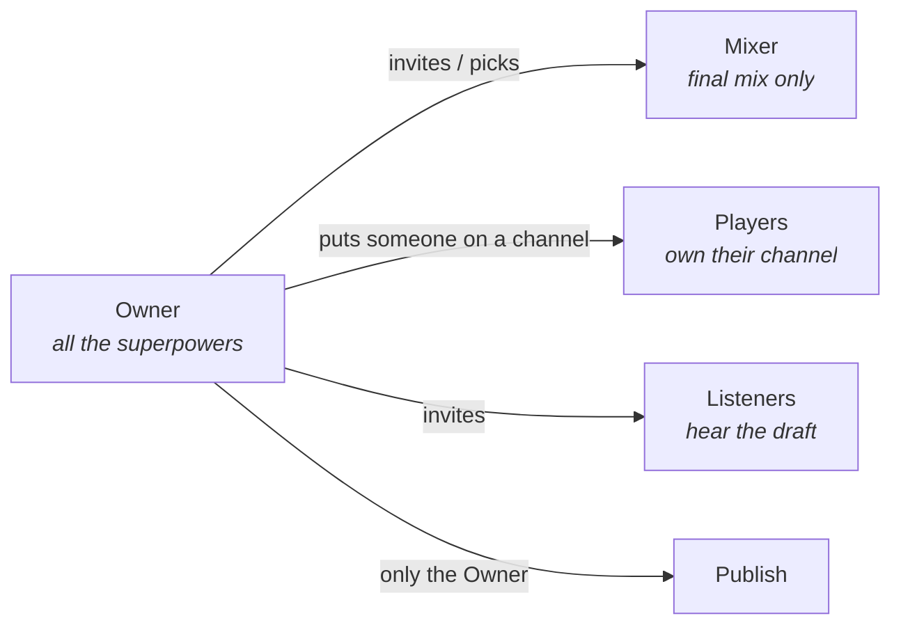
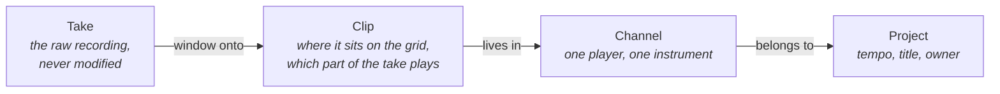
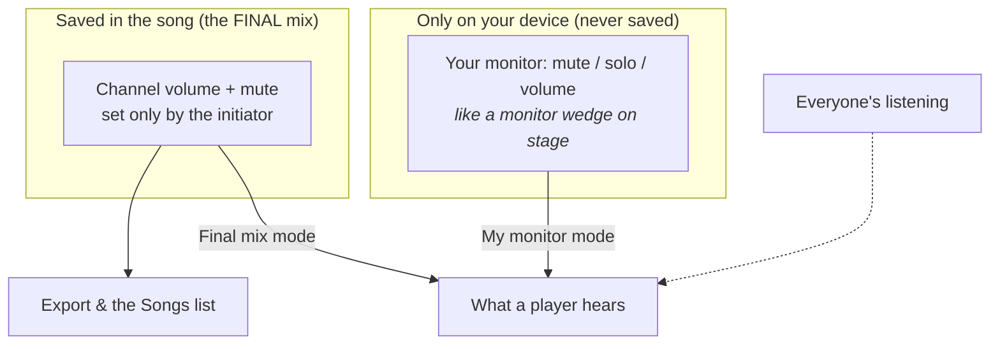
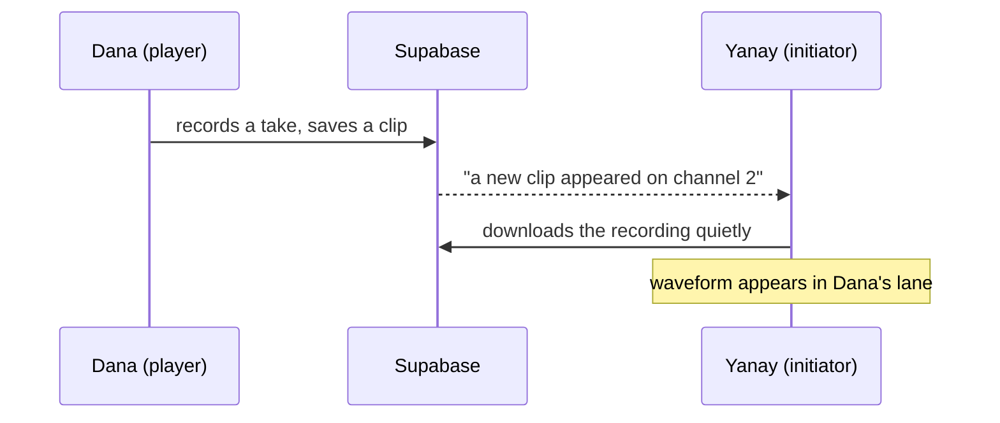
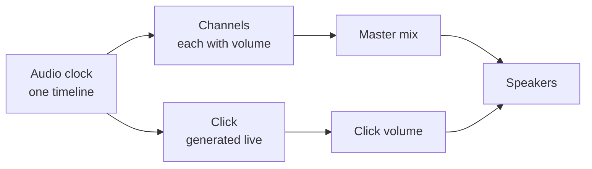
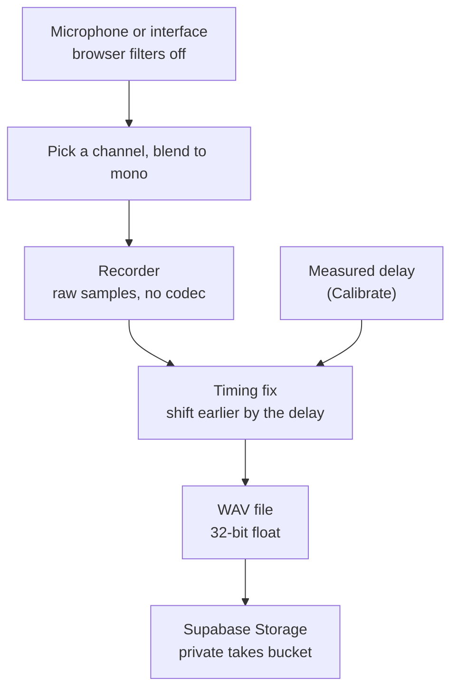

# How Play Your Line works

The design notes behind the app: how a project is organised, the screen, the design system, how the
code is laid out, and the audio timing rules. For what the app is and how to run it, see the
[README](../README.md). (Screens say "project"; some code names and diagrams still say "song".)

## Projects, channels and clips

### Roles



### Channels, takes and clips



Every edit only changes a clip's numbers, so **nothing is ever destroyed**:
trim a clip and the audio you cut is still in the take; drag the edge back and
it returns. A clip is just: *start on the timeline · start inside the take ·
length · stacking order*.

### The channel lane

```
┌──────────────┬──────────────────────────────────────────────────────┐
│ Bar          │ 1       2       3       4       5       6            │  ← shared ruler
├──────────────┼──────────────────────────────────────────────────────┤
│ ● Dana       │        ┌────────────┐          ┌─────┐               │
│   Guitar     │        │ ∿∿∿∿∿∿∿∿∿∿ │          │∿∿∿∿∿│               │  ← clips on the grid
│ [●] [M][S] ─○│        └────────────┘          └─────┘               │
├──────────────┼──────────────────────────────────────────────────────┤
│   Unclaimed  │  Waiting for a player to join this channel           │
│   Bass       │                                                      │
└──────────────┴──────────────────────────────────────────────────────┘
   Info column                       4/4 bar grid  (playhead runs across all lanes)
   (stays put when
    you scroll)
```

### Adding audio: record, or drop a file

Besides recording, you can drag an audio file straight onto your own channel from your
computer. It's decoded, re-encoded as the same 32-bit float WAV every recording uses, uploaded,
and lands as a clip exactly where you dropped it (snapped to the grid, hold Alt to place freely).
This works only on a channel you own, and never while a recording is in progress. Because it's
re-encoded to full-quality WAV, a very long file can exceed Supabase's per-file storage limit —
the app checks this before uploading and tells you roughly how many minutes fit, rather than
letting the upload fail with a raw storage error.

### Rules of the timeline

| Rule | What it means |
| --- | --- |
| **Time signature** | 4/4 only for now (one constant, `BEATS_PER_BAR`, in `src/lib/grid.ts`) |
| **Snap** | Toggle in the toolbar (magnet). Choose Bar, 1/4, 1/8 or 1/16 — default **on, 1/16**. Hold **Alt** while dragging to place freely. |
| **Tempo lock** | The tempo locks the moment the song has any clip (moving it would drag every recording off the beat). Delete all clips to unlock. |
| **Overlap** | Where two clips overlap, the **newest plays** and the older one is silent underneath — but keeps playing wherever it isn't covered. |
| **Recording placement** | A new take lands exactly where the click was when you pressed record (count-in and latency compensated). |

```
Overlap example — newest clip on top:

older clip   ████████████████████
newer clip            ██████████
what you hear ███████████████████   older plays until the newer one starts,
                     └─ newer ─┘    then the newer takes over
```

### Two mixes: your monitor vs the final mix



- A **player** chooses in the toolbar: **My monitor** (their own levels, saved
  only in their browser) or **Final mix** (exactly what the initiator saved,
  read-only).
- The **initiator's** sliders *are* the final mix and are saved for everyone.
- **Solo** is a listening aid on your own device. It is never saved and never
  ends up in an export.

### Live updates (no refresh needed)

When someone else changes the song, you see it appear on its own. A small
**Live** dot next to the song title shows the connection is on.



| What happens | What you see |
| --- | --- |
| A channel is added, removed, or a player joins it | The lane appears / disappears / gets the player's name |
| A player records, moves, trims or deletes a clip | The clip appears, moves or vanishes in their lane |
| The initiator changes tempo, title, or publishes | Header updates; published state changes |
| The initiator moves a fader | Players in **Final mix** mode hear the new level |
| Connection drops, or a phone wakes up | The app catches up by itself (dot shows Offline → Live) |

Good to know:
- Changes never restart playback. If someone edits while you're listening, you
  hear it from the **next Play**.
- Your own channel is never overwritten by live updates (you're its only editor).
- **Who's here:** small circles next to the song title show who has the song
  open right now; a green dot appears by a player's name on their channel while
  they are here.
- Not included yet: a live "Dana is recording…" badge.

### Colours, zoom and storage

- **Channel colour:** tap the coloured number tab on a channel and pick a colour.
  The initiator's choice is saved for everyone; anyone else recolours only for
  themselves (on their own device).
- **Pinch to zoom:** on a Mac trackpad, pinch over the timeline (or hold Ctrl and
  scroll). The moment under your fingers stays in place. The +/- buttons still work.
- **Storage cleanup:** when you open a song, recording files on *your* channels
  that no clip uses any more (from deleted clips or failed uploads) are deleted.
  Files younger than 10 minutes are never touched, and removing an empty channel
  clears its leftover files. Nobody's recordings are removed by anyone else.
- **How much space you use:** Supabase → Project Settings → Usage, or run in the
  SQL Editor: `select round(sum((metadata->>'size')::bigint)/1048576.0) as mb, count(*) as files from storage.objects where bucket_id = 'takes';`
  Recordings are 32-bit float WAV, about **11.5 MB per minute per channel**.

### The screen: control bar, loop and phones

```
┌────────────────────────────────────────────────────────────────────────────┐
│            [⏮][▶][■][●]   ┌ 2 │ 3 │ 0:03.9 │ − 90 + │ 4/4 ┐   [⟲][1234][♩][S] │
│                            │  bar beat  time    bpm   sig  │  loop count-in click clear-solo │
│                            └──── number display, centred ──┘                    │
├────────────────────────────────────────────────────────────────────────────┤
│ [⚙][👤+][⊕]  [↶][↷] [✂][⧉][🗑] [🧲 1/16] [− +]            second row: panels and editing tools │
└────────────────────────────────────────────────────────────────────────────┘
```

- **Control bar** (Logic style): transport (back to start, play, **stop**, **record**), the dark
  number display in the middle (bar, beat, time, tempo, signature), and on the right loop,
  **1234** count-in (blue when on), click on/off with its volume, and **S** which turns off every
  solo. The slim second row holds the panel buttons — audio settings, **Add channel** (anyone in
  the project), **People** (Mixer/Listener invites, Owner only) — and the editing tools.
- **Record** is the red button in the bar (or the **R** key). It records on your **armed**
  channel: on each of your channels a small dot button (next to M and S) arms it — filled red
  means Record goes there, locked while that channel is already recording. **Stop** (or **Space**)
  stops a recording if one's running, otherwise stops playback.
- **Your role** (Owner, Mixer, Player, Listener) is a small badge at the right of the control bar (`ProjectBar.tsx`); the back button and the project name are at its left. Publish, Unpublish and Export Mix live on the project cards in the home list (`ProjectCardActions.tsx`, `lib/projectActions.ts`).
- **Loop:** drag on the thin strip *under the bar numbers* to highlight a part; it turns the loop
  on. Drag the highlight to move it, its edges to resize it (snaps to the grid, hold Alt to
  place freely). The **loop button** switches it on/off; with no highlight yet it uses the
  selected clip, or four bars from the playhead. The highlighted part is shaded across all
  channels. Playback runs from wherever you start to the loop's end, then repeats the loop.
  Every pass is scheduled on the same audio clock as the click, so nothing drifts. The loop is
  personal and temporary (never saved) and is ignored while recording and in exports.
- **Channels use the full screen width**, edge to edge, each as one strip: colour/number
  tab · instrument · player name · (on your own channel) an arm dot · M (mute) S (solo) · fader ·
  **FX** (Owner/Mixer, or the channel's own player). The fader is a real dB scale (−60..+6): 0 dB
  (unity, the default) rests near the top, like a real console — most of the travel is fine
  control right around unity, with a little headroom above and a steep drop toward silence below.
  Underneath the fader, a row of 5 signal lights shows the microphone level while that channel is
  armed, or the channel's own live output level the rest of the time.
- **Channel FX** (EQ / Compressor / Delay / Reverb): click **FX** to open a small, draggable
  plugin-style window. A **power switch** (off by default) turns the channel's effects on; each
  effect also has its own bypass. The header holds a preset menu, Undo (this visit only), Reset and
  **Compare** (hear it dry, local only, never saved); the Owner/Mixer also see a **lock**. Tabs can
  be **dragged out** of the tab strip into their own draggable windows and docked back (Dock / Dock all). Every FX window (and the tuner) is moved back onto the screen when it opens, changes size or the browser is resized, so none opens half cut off at the bottom. Closing the main window leaves any tab that was dragged out open and on top; the FX button on the strip shows or hides the main window again. Every FX window has a resize corner (a `transform: scale`, 1x to 2x, capped on narrow screens; the main window remembers it in `pyl.fxScale`). Every knob is
  drag-to-turn (vertical drag, Shift to fine-tune, scroll to nudge, double-click to reset). The EQ
  has a separate Low cut (12 dB per octave high-pass, 20-400 Hz, off at 20) and a gain knob and a frequency knob per band (low shelf 40-800 Hz, mid peak 200 Hz-8 kHz, high shelf 1.5-16 kHz, log-spaced) and shows its frequency-response curve, calculated from the settings with the filters' own formulas (`eqResponseDb`, checked against the browser's filter to 0.000 dB) so it stays right even while the EQ is bypassed; the Compressor has threshold, ratio, attack, release and
  make-up, a live level meter and a gain-reduction meter. Effects that are off or neutral are taken
  out of the signal path (`fxChain.ts`), and Export Mix builds the same chain, so a mix sounds the
  same everywhere. Volume, mute and pan stay Owner/Mixer-only; FX is shared with the channel's own
  player unless the Owner or Mixer locks the channel (enforced by the database).
- **Notes** (`components/notes/`, `lib/notes.ts`): a tray, floating cards and ruler flags, with
  @tags (`mentions` column), a pin to any bar, channel colours, and a "tagged you" badge and message.
- **Anchored pop-ups** (`lib/anchor.ts`): the "?" help pop-up, tooltips and the note bubble are placed by the browser against what they belong to (CSS anchor positioning; the help pop-up is also a top-layer popover so a scaled or clipped window can't move it). They follow their anchor, flip to the other side or lean away from a screen edge on their own, and where the feature is missing the old measured placement runs instead. An anchored pop-up must come AFTER its anchor in the page, so tooltips are rendered at the end of the page each time.
- **FX window placement:** a channel's FX window first opens placed by the browser against its FX button (below it, or above it when there is no room; `fx-anchored`), and turns into plain coordinates at the first drag or resize. A window left enlarged opens by coordinates instead, and every FX window is kept on the screen (`useKeepOnScreen`).
- **Help** (`pages/HelpPage.tsx`, `lib/helpContent.ts`, `components/HelpHint.tsx`): one list of questions and answers used by the Help page and by the small "?" pop-ups (which open straight under their button and can be dragged by their title if they cover the thing they explain).
- **Chords and tuner** (`lib/chords.ts`, `lib/tuner.ts`, `TunerPanel.tsx`): our own detectors, pure and tested. The tuner opens from a tuning-fork button at the bottom of the FX window, in a window of its own that stays when the box is closed (a strobe display on a canvas, auto or per-string, bass-capable: 25 Hz to 1.3 kHz, within 1 cent in tests).
- **On a phone** (tested at 375 px wide, iPhone 13 mini): the bar sticks to the top while you
  scroll. Row 1 is transport plus the number display; row 2
  is a sideways-sliding strip with everything else. Each channel strip is three short lines in
  a narrower column so the clips get the room. Drag-to-reorder is desktop only.
- **Errors** appear as a small dismissible message at the bottom of the screen.

## Design system

An Apple HIG-inspired look, light and dark aware, in plain CSS (`src/index.css` holds the tokens,
`src/app.css` the components). Everything uses the tokens, never literal colours.

| Token | Light | Dark | Used for |
| --- | --- | --- | --- |
| `--color-bg` | `#f2f2f7` | `#000000` | page background |
| `--color-bg-elevated` | `#ffffff` | `#1c1c1e` | cards, bars |
| `--color-fill` / `-secondary` | grey at 12% / 16% | grey at 24% / 32% | buttons, inputs, tracks |
| `--color-label` / `-secondary` / `-tertiary` | `#1d1d1f` / 60% / 30% | `#f5f5f7` / 60% / 30% | text |
| `--color-separator` | grey at 29% | grey at 60% | hairlines |
| `--color-accent` | `#007aff` | `#0a84ff` | the brand blue: primary actions, "on" states, 1234 count-in |
| `--color-red` / `--color-green` | `#ff3b30` / `#34c759` | `#ff453a` / `#30d158` | record and errors / published and OK |

- **Shapes:** pill buttons (fully rounded) for actions, 12-14 px corners for cards and cover tiles,
  6 px for small controls. Cards use one soft shadow (`--shadow-card`).
- **Channel colours:** twelve colours in `src/lib/trackColors.ts`; the first six are handed to new
  channels in turn. The home cover art draws from the same palette.
- **Control bar:** a dark, glassy "hardware" strip (number display with bar / beat / time / tempo
  cells), deliberately a little different from the soft cards around it.
- **Plugin windows (channel FX):** a darker panel with cyan accents, drag-to-turn knobs and a real
  EQ curve, so FX feels like a plugin rather than a settings form.
- **Type:** the system font (`-apple-system`, SF Pro on Apple devices), with numbers set in tabular
  figures wherever digits line up.
- **Cover art:** line-art motifs (rings, orbit, sparkle, stones, waveform, vortex) on a soft
  single-colour gradient, each with a slow, subtle movement that is switched off under
  reduced-motion.
- **Errors:** a dismissible message at the bottom of the screen; inline errors are bold red text.
- **Copy:** the screens say "project" (the code, routes and some diagrams still say "song").

## How the app is put together

Three layers:

1. **Screens** (`src/pages`, `src/components`) — Home, the project editor, the
   published list, the invite page.
2. **Audio engine** (`src/lib/audioEngine.ts`) — records, plays, mixes, runs the
   click. Plain Web Audio, no framework.
3. **Supabase** — sign-in, projects / channels / takes / invites, permissions, and
   the private audio files.

### Playing a song



Every channel and every click is scheduled against **one** audio clock and one
shared start time, so they begin on the same sample.

### Recording a take



### Project layout

```
src/
  App.tsx                      routes
  pages/                       HomePage (cover-art shelves), SongPage (the editor), SongsListPage
                               (published), InvitePage (player links), JoinPage (mixer / listener links)
  components/
    arrangement/               Arrangement (ruler + lanes + playhead), ChannelLane,
                               ChannelInfo, ChannelMeter, ChannelFx (EQ/Comp/Delay/Reverb),
                               Knob, EqCurve, ClipView, Ruler, EditToolbar
    Transport (the one control bar), TempoControl, SettingsPanel,
    AddChannelPanel (add / assign / reassign), PeoplePanel (mixer + listeners), ProjectCover
    (generated or uploaded cover), PresenceDots, ErrorToast, SignInGate (+ first-sign-in name prompt) ...
  store/
    useAuthStore.ts            who is signed in
    useProjectStore.ts         the open song + audio settings
  lib/
    audioEngine.ts             playback, click, recording, calibration
    latency.ts                 timing math (pure, unit-testable)
    clips.ts                   clip rules: overlap, move, trim, split, duplicate, fades (pure)
    grid.ts                    bars / beats / snapping (pure)
    mix.ts                     which mix a listener hears (pure)
    dbFader.ts                 fader ↔ decibel conversion (pure)
    loop.ts                    loop-region timing (pure)
    channelFx.ts               FX settings, presets, which effects run, database columns (pure)
    fxChain.ts                 the effects audio graph, shared by playback and Export Mix
    notes.ts, chords.ts, tuner.ts   notes and @tags, chord detector, pitch detector (pure)
    realtime.ts, remoteMerge.ts  live updates + who's here
    roles.ts                   Owner / Mixer / Player / Listener (pure)
    trackOrder.ts, trackColors.ts   channel order and colours (pure)
    orphans.ts                 which recording files are unused (pure)
    waveform.ts, segmentPlayback.ts
    projectApi.ts              every Supabase read / write
    coverImage.ts              shrinks a cover image before upload
    errorMessage.ts            reads the message out of a Supabase error
    mixdown.ts, wav.ts         export and 32-bit float WAV encoding
    inputDevices.ts, outputDevices.ts
  worklets/pcm-recorder-processor.js   lossless capture on the audio thread
supabase/migrations/           database schema, permissions, invite and assignment functions (0001-0037)
scripts/test-timing.ts         checks for the latency math
scripts/test-clips.ts          checks for clips, overlap, grid, mix, order, roles, cleanup, FX rules, notes, chords, tuner   (npm test runs both)
```

## Audio timing principles

This is the part that decides whether a recording feels *tight*. The rules the
engine follows:

- **One clock.** Everything — channels and click — is scheduled on the audio
  hardware clock, never on JavaScript timers. A short look-ahead scheduler only
  *queues* clicks; the exact moment each one sounds is fixed by the audio clock.
- **One shared start time.** Playback starts a few milliseconds in the future,
  and every source is scheduled relative to that single instant.
- **Same path for click and channels.** By default the click goes to the same
  output as the channels, so it has the same delay. A separate click output is
  optional and can sit slightly off, because the browser can't measure it.
- **Latency compensation.** Sound takes time to reach the speakers and come back
  in through the mic. Each take is shifted earlier by that round-trip delay —
  from the browser's own estimate, a measured **Calibrate** run (plays clicks,
  listens for them), or a value you enter by hand. Calibration refuses to guess
  when it can't hear the clicks (e.g. headphones).
- **Takes land where they were played.** A take is placed at the song position
  where recording started, not always at 0:00. Anything captured before that
  point is dropped.
- **Count-in.** Recording starts with 4 clicks at the song tempo (Settings →
  Metronome → Count-in; on by default, works even with the click track off). The
  song begins on the beat right after the last click, and the count-in never
  ends up inside the take.
- **Trimming never moves the music.** Cutting the start of a take keeps the
  remaining audio exactly where it was played, so it stays locked to the click.
- **No damage on the way in.** Echo cancellation, noise suppression and
  auto-gain (speech-call defaults that ruin instrument tone) are switched off.
  Audio is captured as raw samples and stored as **32-bit float WAV** — no lossy
  codec anywhere. Export uses the same format.

